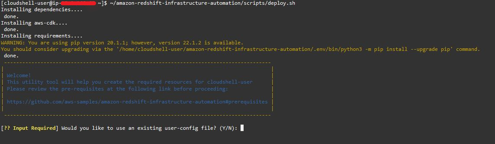
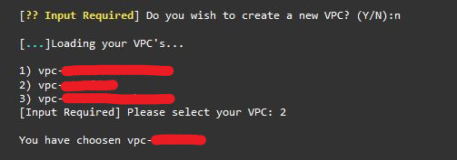
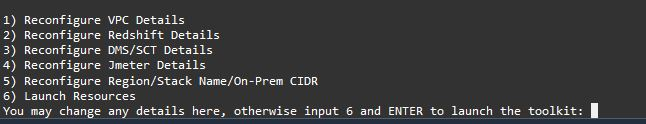

# AWS Analytics Automation Toolkit

As analytics solutions have moved away from the one-size-fits-all model to choosing the right tool for the right function, architectures have become more optimized and performant while simultaneously becoming more complex. Solutions leveraging Amazon Redshift will often be used alongside services including AWS DMS, AWS AppSync, AWS Glue, AWS SCT, Amazon Sagemaker, Amazon QuickSight, and more. One of the core challenges of building these solutions can oftentimes be the integration of these services.

This solution takes advantage of the repeated integrations between different services in common use cases, and leverages the [AWS CDK](https://aws.amazon.com/cdk/) to automate the provisioning of AWS analytics services, primarily Amazon Redshift.  --> Deployment consists of running through a bash menu to indicate the resources to be used, and this solution takes those inputs to auto-provision the required infrastructure dynamically.  <--

PLEASE NOTE: This solution is meant for proof of concept or demo use cases, and not for production workloads.

## Table of Contents

1. [Overview of Deployment](#overview-of-deployment)
1. [Prerequisites](#prerequisites)
1. [Deployment Steps](#deployment-steps)
1. [Post deployment](#post-deployment)
1. [Clean up](#clean-up)
1. [Troubleshooting](#troubleshooting)
1. [Feedback](#feedback)

## Overview of Deployment

This project leverages [CloudShell](https://aws.amazon.com/cloudshell/), a browser-based shell service, to programmatically initiate the deployment through the AWS console. To achieve this, the user will clone this repository and run the deployment command. Afterwards a bash menu will appear helping the user in specifying the desired service configurations.

The following sections give further details of how to complete these steps.

## Prerequisites

Prior to deployment, some resources need to be preconfigured:
* Please verify that you will be deploying this solution in a [region that supports CloudShell](https://docs.aws.amazon.com/general/latest/gr/cloudshell.html)
* Execute the deployment with an IAM user with permissions to use:
	- AWS CloudShell
	- AWS Identity and Access Management (IAM)
	- AWS CloudFormation
	- Amazon SSM
	- Amazon Redshift
	- Amazon S3
	- AWS Secrets Manager
	- Amazon EC2
	- AWS Database Migration Service (DMS)
	- For a more granular list of permissions, please see [here](./permissionlist.md)
* [OPTIONAL] If using SCT or JMeter:
	* 	 create a key pair that can be accessed (see [the documentation](https://docs.aws.amazon.com/AWSEC2/latest/UserGuide/ec2-key-pairs.html#having-ec2-create-your-key-pair) on how to create a new one)
	* 	 ensure your VPC contains subnets which can access outbound internet; via an internet gateway or NAT gateway
* [OPTIONAL] If using an external database, open source firewalls/ security groups to allow for traffic from AWS
* [OPTIONAL] If using Datasharing please ensure both producer and consumer cluster are in the same region/account. Publically enabled clusters are supported. For all other considerations please refer to the [Datasharing Considerations](https://docs.aws.amazon.com/redshift/latest/dg/considerations.html) documentation. 

If these are complete, continue to [deployment steps](#deployment-steps). If you come across errors, please refer to the [troubleshooting](#troubleshooting) section -- if the error isn't addressed there, please submit the feedback using the [Issues](https://github.com/aws-samples/amazon-redshift-infrastructure-automation/issues) tab of this repo.


## Deployment Steps

1. Open [CloudShell](https://console.aws.amazon.com/cloudshell/home?)

4. Clone the Git repository

	`git clone https://github.com/aws-samples/amazon-redshift-infrastructure-automation.git`

5. Run the deployment script

	`~/amazon-redshift-infrastructure-automation/scripts/deploy.sh`
	
6. Follow the prompts and specify desired resources using Y/y/N/n or corresponding numbers. Press *Enter* to confirm your selection. Towards the end users will also be able to change any inputs.



Example of using Y/y/N/n or numbers corresponding to inputs



7. At the end of the menu you may go back and reconfigure any desired inputs. Otherwise input 6 and launch resources!




9. Depending on your resource configuration, you may receive some additional input prompts:

|	Prompt	|	Input	|	Description	|
|-----------|-----------|---------------|
||Password of external database|If are using an external database, will create a Secrets Manager secret with the password value|
||Password of existing Redshift cluster|If are giving a Redshift endpoint in the user_config.json file, will create a Secrets Manager secret with the password for the cluster database|


### Post deployment

Once the script has been run, you can monitor the deployment of CloudFormation stacks through the CloudShell terminal, or with the CloudFormation console.


## Clean up

1. Open [CloudShell](https://aws.amazon.com/cloudshell/)
2. run the destroy script: `~/amazon-redshift-infrastructure-automation/scripts/destroy.sh`
3. enter the stackname when prompted, and click Yes when prompted, to destroy the stack.


## Troubleshooting

* Error: `User: [IAM-USER-ARN] is not authorized to perform: [ACTION] on resource: [RESOURCE-ARN]`

	User running CloudShell doesn't have the appropriate permissions required - can use a separate IAM user with appropriate permissions:

	NOTE: User running the deployment (logged into the console) still needs **AWSCloudShellFullAccess** permissions
	1. Open the [IAM console](https://console.aws.amazon.com/iamv2/home?#/home)
	2. Under **Users**, select **Add users**
	3. Create a new user

	

	4. Select **Next: Permissions**
	5. Add the following policies:
		- IAMFullAccess
		- AWSCloudFormationFullAccess
		- AmazonSSMFullAccess
		- AmazonRedshiftFullAccess
		- AmazonS3FullAccess
		- SecretsManagerReadWrite
		- AmazonEC2FullAccess
		- Create custom DMS policy called **AmazonDMSRoleCustom** -- select **Create policy** with the following permissions:
			```
			{
				"Version": "2012-10-17",
				"Statement": [
					{
					"Effect": "Allow",
					"Action": "dms:*",
					"Resource": "*"
					}
				]
			}
			```
	
	

	6. Get and download the CSV containing the Access Key and Secret Access Key for this user -- these will be used with Cloudshell:

	

	7. When first open CloudShell, run
		
		'aws configure'

	8. Enter the Access Key and Secret Access Key downloaded for the IAM user created in the [Prerequisites](#prerequisites)

		
* Error: `An error occurred (InvalidRequestException) when calling the CreateSecret operation: You can't create this secret because a secret with this name is already scheduled for deletion.`

	This occurs when you use a repeated stack name for the deployment, which results in a repeat of a secret name in Secrets Manager. Either use a new stack name when prompted for it, or delete the secrets by replacing `[STACK NAME]` with the stack name used for the deployment in the following commands and running them in CloudShell:

	`aws secretsmanager delete-secret --secret-id [STACK NAME]-SourceDBPassword --force-delete-without-recovery`

	`aws secretsmanager delete-secret --secret-id [STACK NAME]-RedshiftPassword --force-delete-without-recovery`
	
	`aws secretsmanager delete-secret --secret-id [STACK NAME]-RedshiftClusterSecretAA --force-delete-without-recovery`

	Then rerun:

	`~/amazon-redshift-infrastructure-automation/scripts/deploy.sh`

## Feedback

Our aim is to make this tool as dynamic and comprehensive as possible, so we’d love to hear your feedback. Let us know your experience deploying the solution, and share any other use cases that the automation solution doesn’t yet support. Please use the [Issues](https://github.com/aws-samples/amazon-redshift-infrastructure-automation/issues) tab under this repo, and we’ll use that to guide our roadmap. 

## Security

See [CONTRIBUTING](CONTRIBUTING.md#security-issue-notifications) for more information.

## License

This library is licensed under the MIT-0 License. See the LICENSE file.
