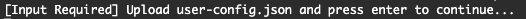
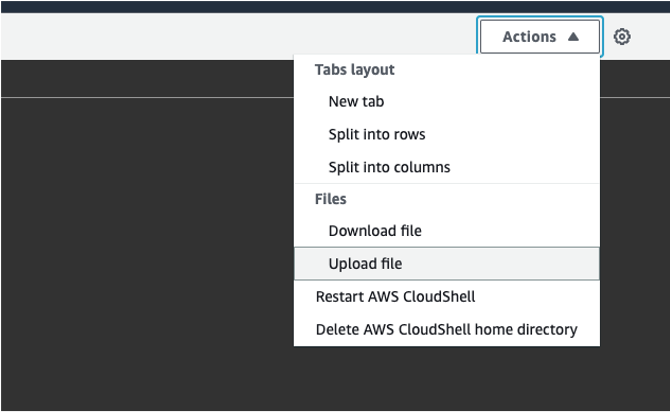
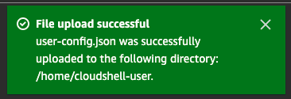
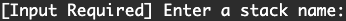
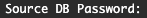
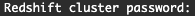
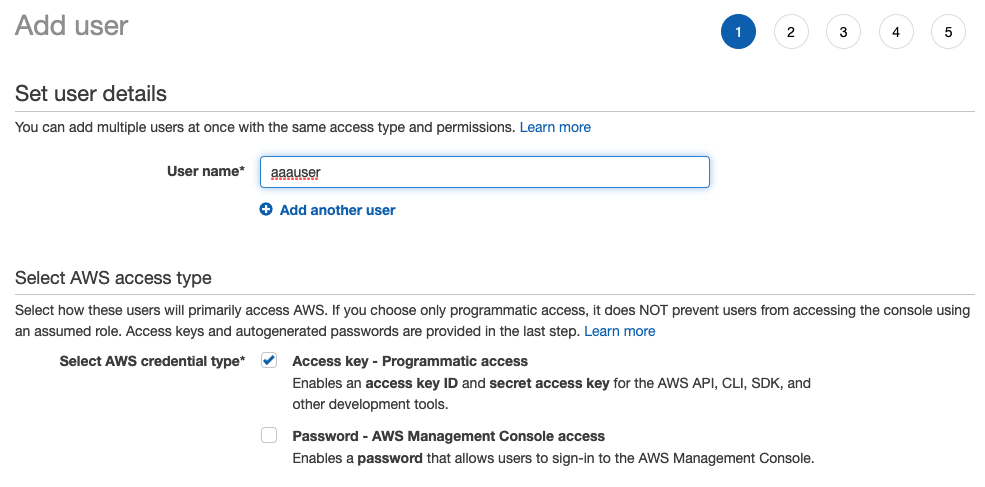
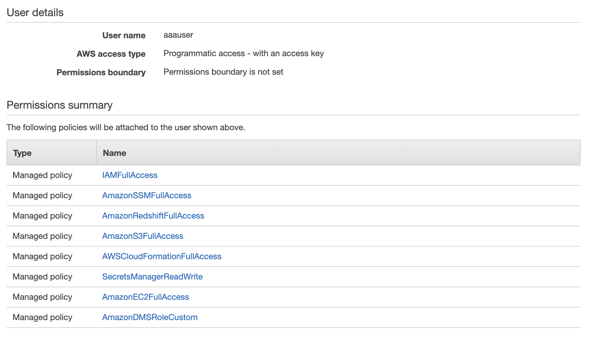
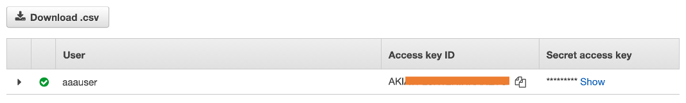
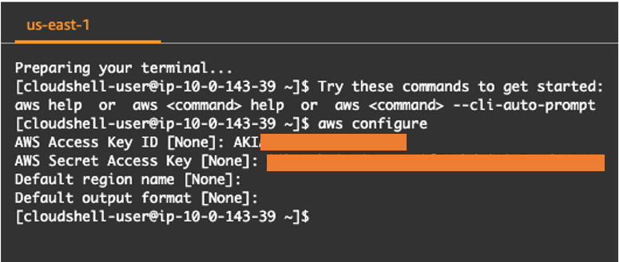

# AWS Analytics Infrastructure Automation

As analytics solutions have moved away from the one-size-fits-all model to choosing the right tool for the right function, architectures have become more optimized and performant while simultaneously becoming more complex. Solutions leveraging Amazon Redshift will often be used alongside services including AWS DMS, AWS AppSync, AWS Glue, AWS SCT, Amazon Sagemaker, Amazon QuickSight, and more. One of the core challenges of building these solutions can oftentimes be the integration of these services.

This solution takes advantage of the repeated integrations between different services in common use cases, and leverages the [AWS CDK](https://aws.amazon.com/cdk/) to automate the provisioning of AWS analytics services, primarily Amazon Redshift. Deployment is now customizing a JSON configuration file indicating the resources to be used, and this solution takes those inputs to auto-provision the required infrastructure dynamically.

PLEASE NOTE: This solution is meant for proof of concept or demo use cases, and not for production workloads.

## Table of Contents

1. [Overview of Deployment](#overview-of-deployment)
1. [Prerequisites](#prerequisites)
1. [Deployment Steps](#deployment-steps)
	1. [Configure the config file](#configure-the-config-file)
	1. [Launch the infrastructure](#launch-the-infrastructure)
	1. [Post deployment](#post-deployment)
1. [Clean up](#clean-up)
1. [Troubleshooting](#troubleshooting)
1. [Feedback](#feedback)

## Overview of Deployment

This project leverages [CloudShell](https://aws.amazon.com/cloudshell/), a browser-based shell service, to programmatically initiate the deployment through the AWS console. To achieve this, a JSON-formatted config file specifying the desired service configurations needs to be uploaded to CloudShell. Then, a series of steps need to be run to clone this repository and initiate the CDK scripts.

The following sections give further details of how to complete these steps.

## Prerequisites

Prior to deployment, some resources need to be preconfigured:
* Please verify that you will be deploying this solution in a [region that supports CloudShell](https://docs.aws.amazon.com/general/latest/gr/cloudshell.html)
* Execute the deployment with an IAM user with permissions to use:
	- AWSCloudShellFullAccess
	- IAMFullAccess
	- AWSCloudFormationFullAccess
	- AmazonSSMFullAccess
	- AmazonRedshiftFullAccess
	- AmazonS3FullAccess
	- SecretsManagerReadWrite
	- AmazonEC2FullAccess
	- Create custom DMS policy called **AmazonDMSRoleCustom** -- select **Create policy** with the following permissions:
		```	
		{
			"Version": "2012-10-17",
			"Statement": [
				{
				"Effect": "Allow",
				"Action": "dms:*",
				"Resource": "*"
				}
			]
		}
		```

* [OPTIONAL] If using SCT, create a key pair that can be accessed (see [the documentation](https://docs.aws.amazon.com/AWSEC2/latest/UserGuide/ec2-key-pairs.html#having-ec2-create-your-key-pair) on how to create a new one)
* [OPTIONAL] If using an external database, open source firewalls/ security groups to allow for traffic from AWS

If these are complete, continue to [deployment steps](#deployment-steps). If you come across errors, please refer to the [troubleshooting](#troubleshooting) section -- if the error isn't addressed there, please submit the feedback using the [Issues](https://github.com/aws-samples/amazon-redshift-infrastructure-automation/issues) tab of this repo.


## Deployment Steps

In order to launch the staging and target infrastructures, download the [user-config-template.json](./user-config-template.json) file in this repo. 

### Configure the config file

The structure of the config file has two parts: (1) a list of key-value pairs, which create a mapping between a specific service and whether it should be launched in the target infrastructure, and (2) configurations for the service that are launched in the target infrastructure. Open the [user-config-template.json](./user-config-template.json) file and replace the values for the Service Keys in the first section with the appropriate  Launch Value defined in the table below. If you're looking to create a resource, define the corresponding Configuration fields in the second section.


| Service Key | Launch Values | Configuration | Description |
| ----------- | ------------- | ------------- | ----------- |
| `vpc_id`    | `CREATE`, existing VPC ID | In case of `CREATE`, configure `vpc`:<br>`on_prem_cidr`: CIDR block used to connect to VPC (for security groups)<br>`vpc_cidr`: The CIDR block used for the VPC private IPs and size<br>`number_of_az`: Number of Availability Zones the VPC should cover<br>`cidr_mask`: The size of the public and private subnet to be launched in the VPC. | [REQUIRED] The VPC to launch the target resources in -- can either be an existing VPC or created from scratch. |
| `redshift_endpoint` | `CREATE`, `N/A`, existing Redshift endpoint | In case of `CREATE`, configure `redshift`:<br>`cluster_identifier`: Name to be used in the cluster ID<br>`database_name`: Name of the database<br>`node_type`: `ds2.xlarge`, `ds2.8xlarge`, `dc1.large`, `dc1.8xlarge`, `dc2.large`, `dc2.8xlarge`, `ra3.xlplus`, `ra3.4xlplus`, or `ra3.16xlarge`<br>`number_of_nodes`: Number of compute nodes<br>`master_user_name`: Username to be used for Redshift database<br>`subnet_type`: Subnet type the cluster should be launched in -- `PUBLIC` or `PRIVATE` (note: need at least 2 subnets in separate AZs)<br>`encryption`: Whether the cluster should be encrypted -- `y`/`Y` or `n`/`N` | Launching a Redshift cluster. |
| `dms_on_prem_to_redshift_target` | `CREATE`, `N/A` | *Can only CREATE if are also creating Redshift cluster.*<br>In case of `CREATE`,<br>1. Configure `dms_migration`:<br>`migration_type`: `full-load`, `cdc`, or `full-load-and-cdc`<br>`subnet_type`: Subnet type the cluster should be launched in -- `PUBLIC` or `PRIVATE` (note: need at least 2 subnets in separate AZs)<br>2. Configure `external_database`:<br>`source_db`: Name of source database to migrate<br>`source_engine`: Engine type of the source<br>`source_schema`: Name of source schema to migrate<br>`source_host`: DNS endpoint of the source<br>`source_user`: Username of the database to migrate<br>`source_port`: [INT] Port to connect to connect on| Creates a migration instance, task, and endpoints between a source and Redshift configured above. |
| `sct_on_prem_to_redshift_target` | `CREATE`, `N/A` | *Can only CREATE if are also creating Redshift cluster.*<br>In case of `CREATE`,<br>1. Configure `sct_on_prem_to_redshift`:<br>`key_name`: EC2 key pair name to be used for EC2 running SCT<br>2. Configure `external_database`:<br>`source_db`: Name of source database to migrate<br>`source_engine`: Engine type of the source<br>`source_schema`: Name of source schema to migrate<br>`source_host`: DNS endpoint of the source<br>`source_user`: Username of the database to migrate<br>`source_port`: [INT] Port to connect to connect on| Launches an EC2 instance and installs SCT to be used for schema conversion. |


You can see an example of a completed config file under [user-config-sample.json](./user-config-sample.json).

Once all appropriate Launch Values and Configurations have been defined, save the file as the name *user_config.json*.

### Launch the infrastructure

1. Open [CloudShell](https://console.aws.amazon.com/cloudshell/home?)

4. Clone the Git repository

	`git clone https://github.com/aws-samples/amazon-redshift-infrastructure-automation.git`

5. Run the deployment script

	`~/amazon-redshift-infrastructure-automation/scripts/deploy.sh`
	
6. When prompted



upload the completed user_config.json file



7. When the upload is complete,



press the *Enter* key

8. When prompted



input a unique stack name to be used to identify this deployment, then press the *Enter* key

9. Depending on your resource configuration, you may receive some input prompts:

|	Prompt	|	Input	|	Description	|
|-----------|-----------|---------------|
||Password of external database|If are using an external database, will create a Secrets Manager secret with the password value|
||Password of existing Redshift cluster|If are giving a Redshift endpoint in the user_config.json file, will create a Secrets Manager secret with the password for the cluster database|


### Post deployment

Once the script has been run, you can monitor the deployment of CloudFormation stacks through the CloudShell terminal, or with the CloudFormation console.


## Clean up

1. Open the [CloudFormation console](https://console.aws.amazon.com/cloudformation/home?), and select *Stacks* in the left panel:
	1. Filter by the stack name used for the deployment
	1. Select the stacks to be deleted, and select **Delete** at the top


1. To remove secrets produced by the deployment, you can either
	* Open the [Secrets Manager console](https://console.aws.amazon.com/secretsmanager/home?), and select *Secrets* in the left panel
		1. Filter by the stack name used for the deployment
		1. Select each secret, and under *Actions*, select **Delete secret**
	* Replace `[STACK NAME]` in the below prompts below with the stack name used for the deployment and run them in CloudShell:


	`aws secretsmanager delete-secret --secret-id [STACK NAME]-SourceDBPassword --force-delete-without-recovery`

	`aws secretsmanager delete-secret --secret-id [STACK NAME]-RedshiftPassword --force-delete-without-recovery`
	
	`aws secretsmanager delete-secret --secret-id [STACK NAME]-RedshiftClusterSecretAA --force-delete-without-recovery`

## Troubleshooting

* Error: `User: [IAM-USER-ARN] is not authorized to perform: [ACTION] on resource: [RESOURCE-ARN]`

	User running CloudShell doesn't have the appropriate permissions required - can use a separate IAM user with appropriate permissions:

	NOTE: User running the deployment (logged into the console) still needs **AWSCloudShellFullAccess** permissions
	1. Open the [IAM console](https://console.aws.amazon.com/iamv2/home?#/home)
	2. Under **Users**, select **Add users**
	3. Create a new user

	

	4. Select **Next: Permissions**
	5. Add the following policies:
		- IAMFullAccess
		- AWSCloudFormationFullAccess
		- AmazonSSMFullAccess
		- AmazonRedshiftFullAccess
		- AmazonS3FullAccess
		- SecretsManagerReadWrite
		- AmazonEC2FullAccess
		- Create custom DMS policy called **AmazonDMSRoleCustom** -- select **Create policy** with the following permissions:
			```
			{
				"Version": "2012-10-17",
				"Statement": [
					{
					"Effect": "Allow",
					"Action": "dms:*",
					"Resource": "*"
					}
				]
			}
			```
	
	

	6. Get and download the CSV containing the Access Key and Secret Access Key for this user -- these will be used with Cloudshell:

	

	7. When first open CloudShell, run
		
		'aws configure'

	8. Enter the Access Key and Secret Access Key downloaded for the IAM user created in the [Prerequisites](#prerequisites)

		
* Error: `An error occurred (InvalidRequestException) when calling the CreateSecret operation: You can't create this secret because a secret with this name is already scheduled for deletion.`

	This occurs when you use a repeated stack name for the deployment, which results in a repeat of a secret name in Secrets Manager. Either use a new stack name when prompted for it, or delete the secrets by replacing `[STACK NAME]` with the stack name used for the deployment in the following commands and running them in CloudShell:

	`aws secretsmanager delete-secret --secret-id [STACK NAME]-SourceDBPassword --force-delete-without-recovery`

	`aws secretsmanager delete-secret --secret-id [STACK NAME]-RedshiftPassword --force-delete-without-recovery`
	
	`aws secretsmanager delete-secret --secret-id [STACK NAME]-RedshiftClusterSecretAA --force-delete-without-recovery`

	Then rerun:

	`~/amazon-redshift-infrastructure-automation/scripts/deploy.sh`

## Feedback

Our aim is to make this tool as dynamic and comprehensive as possible, so we’d love to hear your feedback. Let us know your experience deploying the solution, and share any other use cases that the automation solution doesn’t yet support. Please use the [Issues](https://github.com/aws-samples/amazon-redshift-infrastructure-automation/issues) tab under this repo, and we’ll use that to guide our roadmap. 

## Security

See [CONTRIBUTING](CONTRIBUTING.md#security-issue-notifications) for more information.

## License

This library is licensed under the MIT-0 License. See the LICENSE file.

