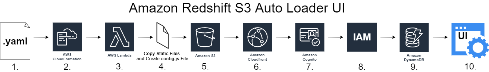

# Amazon Redshift S3 Auto Loader UI

## Description
The Amazon Redshift S3 Auto Loader UI allows you to monitor your data loading processes without having to track down each individual load in the AWS console. Using this UI assumes that the Redshift Auto Loader was already deployed in your AWS account to load data from S3 to Redshift.

Please read through the following to learn about the architecture behind this user interface and how to deploy it using your AWS account.

## Table of Contents

[Architecture](#architecture)

- [Process Flow](#process-flow)

- [Components](#components)

[Prerequisites](#prerequisites)

[User Interface Content](#user-interface-content)

[Cost](#cost)

[Roadmap](#roadmap)

## Architecture
Below is the architecture diagram of the user interface.

### Process Flow
Each of the following steps correlate with one image in the diagram based on the labeled step number to visualize the process flow of deploying the user interface.

1. The user downloads the **LoaderUI.yaml** file from the correct public repository in GitHub to upload to CloudFormation.
2. The user creates a new stack in CloudFormation and uploads the **LoaderUI.yaml** file to begin the automatic provisioning of AWS services required to deploy the user interface.
3. A Lambda function is created that copies static files to a target S3 bucket and generates a config.js file that is also placed in the same target S3 bucket.
4. The Lambda function is invoked and completes both the copying of static files and the generation of a config.js file which are placed in the target S3 bucket that was generated by the CloudFormation stack.
5. All the necessary files including the static files and config.js file now exist in the target S3 bucket which points to a CloudFront distribution that was created by the CloudFormation stack.
6. The user clicks on a CloudFront URL that was generated as an output parameter by the CloudFormation stack.
7. The user is redirected to an Amazon Cognito sign-in page. The user needs to manually create a user in the user pool that was generated by the CloudFormation stack so they can log in and access the user interface.
8. After the user has created their account and successfully logged in using the Amazon Cognito sign-in page, an IAM role and permissions are assigned to the user's account which grants them reading privileges to DynamoDB tables generated from using the auto loader.
9. The DynamoDB tables that were generated from using the auto loader are read to the user interface after the user was assigned their IAM role and permissions.
10. The user can now access the user interface webpage that displays the DynamoDB tables that were originally generated from using the auto loader.

### Components
The following AWS resources are provisioned during the launch of the CloudFormation stack for deploying the user interface. The logical IDs of each resource are listed under each service that is used during the launch of the CloudFormation stack. The type of each resource is listed in parentheses next to each logical ID.
#### [AWS Lambda](https://aws.amazon.com/lambda/) 
* CreateConfigFileAndCopyStaticFiles (AWS::Lambda::Function)

#### [Amazon CloudFront](https://aws.amazon.com/cloudfront/) 
* CloudFrontDistribution (AWS::CloudFront::Distribution)
* CloudFrontOriginAccessIdentity (AWS::CloudFront::CloudFrontOriginAccessIdentity)

#### [Amazon Cognito](https://aws.amazon.com/cognito/) 
* CognitoAppClient (AWS::Cognito::UserPoolClient)
* CognitoIdentityPool (AWS::Cognito::IdentityPool)
* CognitoIdentityPoolRoleAttachment (AWS::Cognito::IdentityPoolRoleAttachment)
* CognitoUserPool (AWS::Cognito::UserPool)
* CognitoUserPoolDomain (AWS::Cognito::UserPoolDomain)

#### [AWS Identity and Access Management (IAM)](https://aws.amazon.com/iam/)  
* DynamoDBAuthIAMRole (AWS::IAM::Role)
* LambdaAuthIAMRole (AWS::IAM::Role)

#### [Amazon S3](https://aws.amazon.com/s3/)
* S3Bucket (AWS::S3::Bucket)
* S3BucketReadPolicy (AWS::S3::BucketPolicy)

#### [AWS CloudFormation](https://aws.amazon.com/cloudformation/)
* LambdaInvoke (AWS::CloudFormation::CustomResource)

## Prerequisites
The following items are prerequisites for deploying the user interface:
* Deployed the Redshift Auto Loader tool
* Downloaded the **LoaderUI.yaml** file from the correct public repository in GitHub

If you have not deployed the Redshift Auto Loader tool yet, please go [here](https://github.com/aws-samples/amazon-redshift-infrastructure-automation/tree/main/Redshift-Loader) for the information and steps to deploy it before attempting to deploy the user interface.

## User Interface Content
There are two panes that make up the main content of the UI:
* Load details overview
* Loader configuration

Under **Load details overview**, there are three tables:
1. The first table counts the number of loads by status and does not have a table header.
2. The second table is the **Copy Command Details** table which pulls from the **s3_data_loader_log** table in DynamoDB.
3. The third table is the **S3 File Details** table which pulls from the **s3_data_loader_file_metadata** table in DynamoDB.

    The **Load details overview** pane has a dropdown button that allows you to filter all three tables based on one of three time frames: **Last 24 Hours**, **Last 7 Days**, and **All Time**. There is one refresh button that exists on top of the first table that allows the user to refresh the first two tables in the **Load details overview** pane. There is another refresh button that exists on top of the **S3 File Details** table that allows the user to individually refresh that table.

Under **Loader configuration**, there are two tables:
1. The first table is the **Redshift Table Details** table which pulls from the **s3_data_loader_table_config** table in DynamoDB.
2. The second table is the **Loader Parameter Details** table which pulls from the **s3_data_loader_params** table in DynamoDB.

    The **Loader configuration** pane has one refresh button on top of each of the two tables for a total of two refresh buttons on the pane. Each refresh button individually refreshes their respective table, similar to how the refresh button on top of the **S3 File Details** table in the **Load details overview** pane individually refreshes the **S3 File Details** table.

## Cost
AWS IAM is free to use where more information can be found [here](https://docs.aws.amazon.com/IAM/latest/UserGuide/introduction.html). The rest of the services offer a free tier but will start accumulating an expense for whatever resources you use that exceeds the free tier.

Please refer to the following pricing information for each service:
* [AWS Lambda](https://aws.amazon.com/lambda/pricing/) 
* [Amazon CloudFront](https://aws.amazon.com/cloudfront/pricing/) 
* [Amazon Cognito](https://aws.amazon.com/cognito/pricing/)
* [Amazon S3](https://aws.amazon.com/s3/pricing/)
* [AWS CloudFormation](https://aws.amazon.com/cloudformation/pricing/)

## Roadmap
Here is a list of items and features that are currently on the roadmap that plan on being implemented in the future.
1.	Automatically copy static files into the target S3 bucket resource from the loader_ui folder in the auto loader’s public GitHub repository instead of the public Redshift blogs S3 bucket.
2.	Add an initial user from CloudFormation and output a username and password that allows the person who is deploying the UI to login immediately instead of having to first manually create a user in Amazon Cognito.
3. Modify one to multiple columns in the Loader Configuration tables using a Modify button.
4. For the first time setting up and deploying the UI, the initial user who is an auth admin can configure a password within the CloudFormation template as a parameter before deployment.
    * Auth admin user can choose to include a non-admin user as a second user that can be configured as a parameter in the CloudFormation template.
5.	Create additional folders to load data either from the original S3 bucket or an additional S3 bucket if the solution was already deployed.
6.	Add and remove users directly from the UI.
7.	Configure email notifications of errors and issues seen in a set time frame to be sent to an email address provided by the user. The user will be able to choose what they are notified about from the following: successful loads, failed loads, or all loads.
8.	Load data to additional Redshift clusters.
9.	Configure parameters: rate at which loading occurs, number of copy commands run per load, Redshift cluster identifier name, database username, database name, database schema name, Redshift IAM Role ARN, copy command options, copy command schedule, and source S3 bucket.
10.	Navigate the rows in the copy command details table using pagination.
11.	Sort and filter rows in the tables by an attribute.
    * A key attribute to filter by in the copy command details table is copy command status which includes the following: FINISHED, Execution, and FAILED.
    * Key attributes to sort by in the copy command details table are finish timestamp and log timestamp which would allow the table to be sorted by the newest or oldest loads. 
12.	Limit how many rows are returned in the copy command details table.
13.	Display the number of copy commands sitting in Simple Queue Service (SQS).
14.	Add new users to one of two groups: admin or non-admin.
